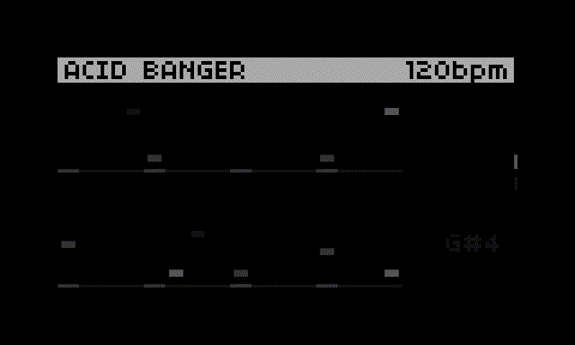

# Acid Banger for Norns

A port of the Endless Acid Banger for [Norns](https://monome.org/docs/norns/).




## About

Acid Banger is a port of the [Endless Acid Banger](https://www.vitling.xyz/toys/acid-banger/) and
the [Spicy Endless Acid Banger](https://zykure.github.io/acid-banger/) for [Norns](https://monome.org/docs/norns/).

It endlessly generates two 303 patterns and one drum pattern.

This script only outputs MIDI. It does not generate any sound on its own.

## Options

Options can be set through the Norns setting screen.

## Installation

```
;install https://github.com/jtopjian/acid_banger
```

## Thanks

This is a port of the web-based Endless Acid Bangers:

* https://github.com/zykure/acid-banger
* https://github.com/vitling/acid-banger

Additionally, this Norns script was pulled together from reading some existing scripts:

* https://github.com/tehn/awake
* https://github.com/toneburst/bline
